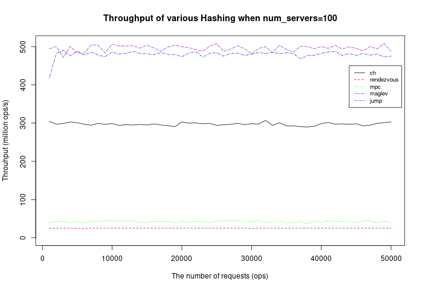
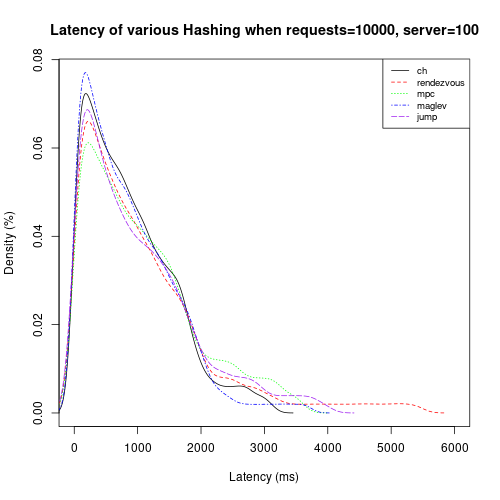
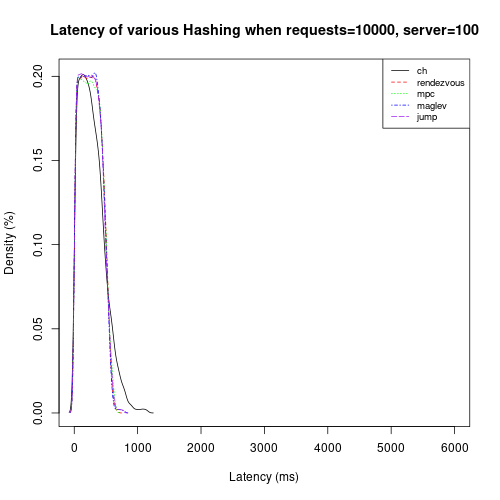
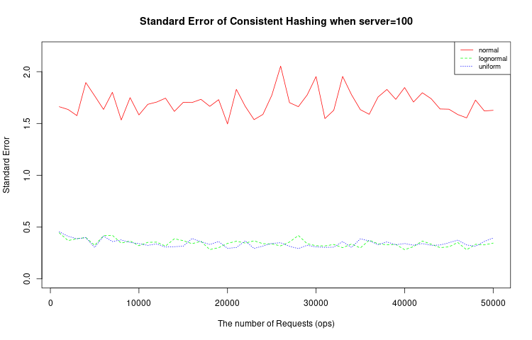

# Throughput
>  Multi-Lines Plot: all_th_server.r, all_th_request.r

<em>Figure 1. Throughput of various Hashing algorithms</em>

From figure 1 we can see that the overall throughput for each algorithm remains stable regardless of the number of requests. This means the time needed to route a request is constant if the number of servers is fixed.

Also, we notice that under the same conditions, Jump Hashing and Maglev Hashing has greater throughput while Rendezvous Hashing and MPC Hashing are lower. This difference is mainly due to their algorithm complexity. In the Rendezvous Hashing algorithm, each candidate node The hash function needs to compute a value h for each candidate node, hence its computing complexity is proportional to the number of servers. On the opposite, the Jump Hashing algorithms do not need to consider the number of servers and its complexity is fixed. In other words, the computing complexity of Consistent Hashing is generally O(N), N stands for the number of servers, while Jump Hashing is O(ln(N)). Hence the throughput line of Jump Hashing is higher than Consistent Hashing.

# Latency

> Density Plot: all_latency_normal.r

<em>
Figure 2.Latency of various Hashing algorithms
a) key distribution = normal, b) key distribution = uniform
</em>

We displayed the latency distribution of two different algorithms in figure 2. For both algorithms, we all observe a tail distribution. However, in the case of the normally distributed keys, there is a lower crest and a longer tail, which shows the impact of workload imbalance caused by the skewed keys.

For different algorithms, under the same conditions, the density lines of Jump Hashing and Maglev Hashing have a higher peak and a shorter tail. Hence they are more resilient to skewed workloads.

# Balancing Degree

> Multi-Lines Plot: all_latency_normal.r

<em>Figure 3. Balancing Degree of Consistent-Hashing algorithm with different key distribution</em>

From figure 3, we can see the balancing degree of different workloads on all nodes. When the keys of requests obey normal distribution, some nodes need to handle more requests than their counterparts. Even for totally random keys, this effect still exists.

Meanwhile, the result also shows that the traditional Consistent Hashing algorithm has a good performance for lognormally and uniformly distributed keys (the blue and green lines are low and very close). We give the credit to a robust hashing function that may map unevenly distributed keys evenly into the keyspace, although this is not true for the case of normal distribution.

